# Laboratorio I

Instalación del entorno de desarrollo que se usará en clase.

A continuación se muestra el proceso de instalación de las herramientas que se usarán en el curso de Electrónica 
Digital I.

### Contenido

- [Instalación de Linux](#instalación-de-linux)
- [Instalación de herramientas](#instalación-de-herramientas)
  - [Instalación de Git](#instalación-de-git)
  - [Instalación de MiniConda](#instalación-de-miniconda)
    - [Creación del entorno virtual](#creación-del-entorno-virtual)
    - [Instalación de GTKWave en el entorno virtual de MiniConda](#instalación-de-gtkwave-en-el-entorno-virtual-de-miniconda)
    - [Instalación de Graphviz en el entorno virtual de MiniConda](#instalación-de-graphviz-en-el-entorno-virtual-de-miniconda)
    - [Instalación de NetListSVG en el entorno virtual de MiniConda](#instalación-de-netlistsvg-en-el-entorno-virtual-de-miniconda)
    - [Instalación de Yosys en el entorno virtual de MiniConda](#instalación-de-yosys-en-el-entorno-virtual-de-miniconda)
    - [Instalación de Icarus Verilog en el entorno virtual de MiniConda](#instalación-de-icarus-verilog-en-el-entorno-virtual-de-miniconda)
  - [Instalación de Digital](#instalación-de-digital)
  - [Instalación de Geany](#instalación-de-geany)
    - [Instalar plugins de Geany](#instalar-plugins-de-geany)
  - [Problemas y soluciones](#problemas-y-soluciones)
    - [Problema con la instalacion de Linux Mint](#problema-con-la-instalación-de-linux-mint)
    - [Problema con la instalación de Digital](#problema-con-la-instalación-de-digital)

# Instalación de Linux

Por sugerencia del profesor Johnny Cubides, se instalará la distribución de Linux [Mint](https://www.linuxmint.com/) en su versión Cinnamon.

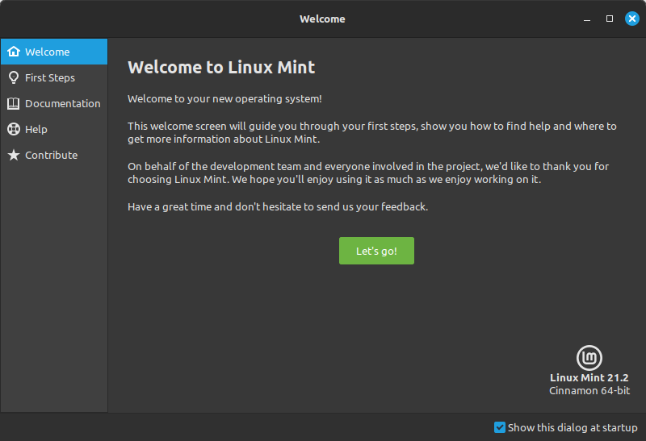

Para proceder con la instalación de Linux Mint, se implementó el proceso a partir de Dual Boot, de esta marena podemos 
mantener el sistema operativo de Windows e instalar Linux en el mismo ordenador. La Bios en este caso se encargará de 
cargar el gestor de arranque y desde el disco duro se llamará al sistema operativo que se desee iniciar. 

Lo primero que se debe realizar es la partición del disco duro; la recomendación para instalar Linux es destinar un 
espacio en memoria de 30 a 100 GB. 

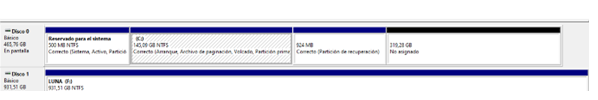

Debemos descargar el ISO de Linux Mint Cinnamon desde [Mint](https://www.linuxmint.com/) y desde [Balena](https://www.balena.io/) descargamos e instalamos 
BalenaEtcher.

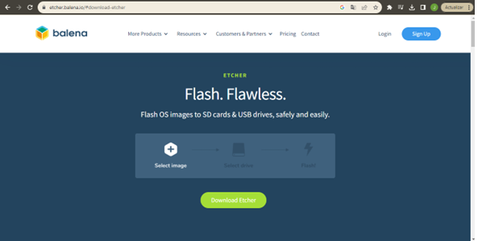

Luego de que finalice la instalación de BalenaEtcher, debemos insertar en el ordenador un pendrive de al menos 8 GB. 
Iniciamos BalenaEtcher para almacenar el instalador de Linux al pendrive.

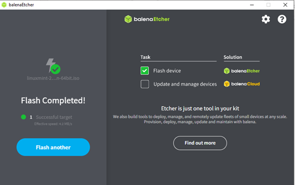

Al finalizar el almacenamiento del instalador de Linux, debemos reiniciar el ordenador con el pendrive conectado; antes 
de que inicie el ordenador se debe oprimir "F1" para ingresar a la BIOS del sistema y poder seleccionar el medio de 
inicio del ordenador, en este caso, se seleccionará el pendrive y luego se dará Enter en Star Linux Mint, para iniciar 
Linux de prueba.

Cuando inicie el sistema operativo, se procederá con la instalación, se debe seleccionar el idioma, luego el tipo de 
teclado, y en Tipo de Instalación de sebe seleccionar "Más opciones" y continuar. En la nueva ventana, se deben 
administrar el espacio libre que se destinó en memoria cuando se realizó la partición del disco. 

Con el espacio libre, se deben realizar 4 particiones, la primera es el área de intercambio, que servirá como 
complemento de la memoria RAM, la segunda es la partición raíz, donde se instalará el sistema operativo y los programas 
que se necesiten, la tercera partición es la EFI, que actúa como el lugar de almacenamiento para los cargadores de 
arranque y por último, la partición Home, donde se guardarán los archivos.

Luego de generar las particiones se continúa con la instalación. Por último se reinicia el ordenador y se desconecta el 
pendrive, y listo ya queda instalado Linux Mint en el ordenador, conservando el sistema operativo Windows.

# Instalación de herramientas

## Instalación de Git

Aunque no está dentro de las herramientas sugeridas por el profesor Johnny Cubides para el curso, se instalará Git para 
poder, desde la terminal de Linux Mint, trabajar los repositorios de GitHub que se necesiten.

Para instalar Git en Linux, se debe ejecutar el siguiente comando:

```sudo apt install git-all```

## Instalación de MiniConda

Para instalar MiniConda en Linux, se debe ejecutar el siguiente comando:

```wget https://repo.anaconda.com/miniconda/Miniconda3-latest-Linux-x86_64.sh```

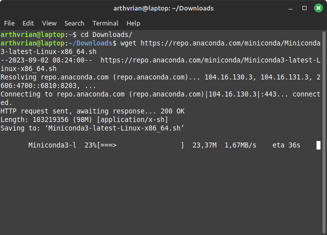

y luego

```bash Miniconda3-latest-Linux-x86_64.sh```

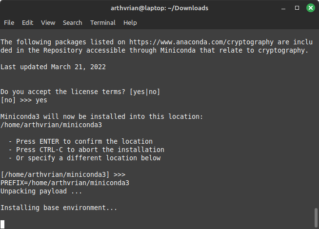

Luego seguir las instrucciones que se muestran en la terminal.

- Licencia de mini conda

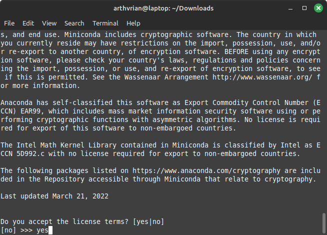

### Creación del entorno virtual

Seguir las instrucciones de la siguiente página: [Instalación de miniconda](https://github.com/johnnycubides/digital-electronic-1-101/tree/main/installTools) del profesor Johnny Cubides

- Actualizar mini conda

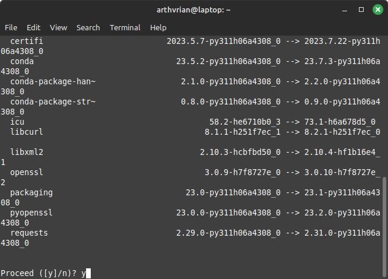

- Inicializar mini conda

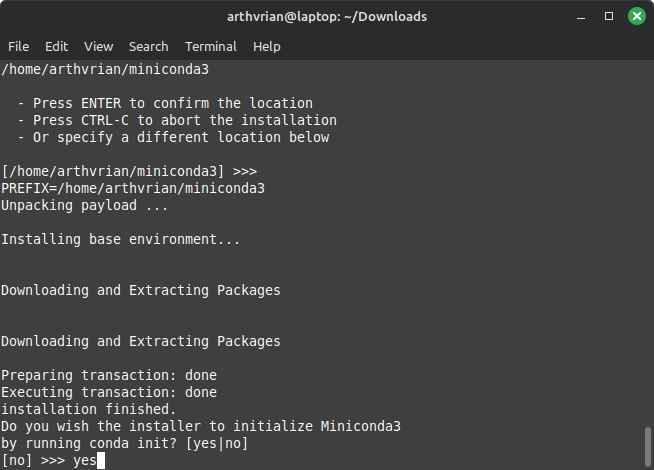

- Crear el entorno virtual

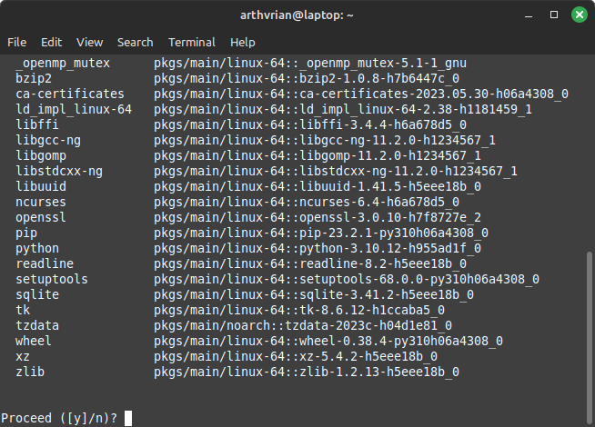
- Activar el entorno virtual

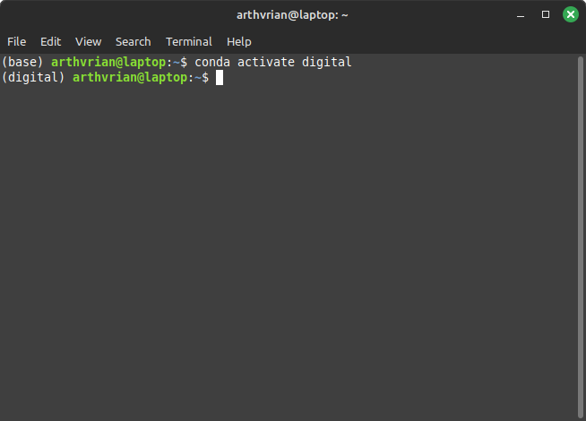


### Instalación de GTKWave en el entorno virtual de MiniConda

Para instalar GTKWave en el entorno virtual de MiniConda en Linux, se debe ejecutar el siguiente comando:

```conda install -c conda-forge gtkwave```

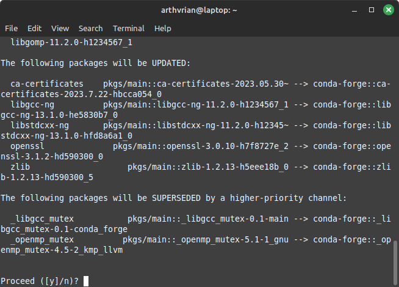

### Instalación de Graphviz en el entorno virtual de MiniConda

Para instalar Graphviz en el entorno virtual de MiniConda en Linux, se debe ejecutar el siguiente comando:

```conda install -c conda-forge graphviz```

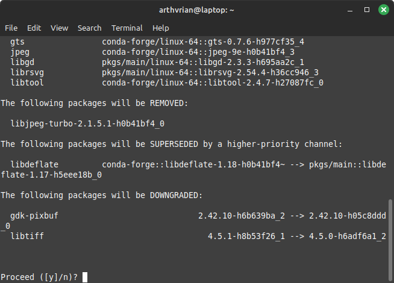

### Instalación de NetListSVG en el entorno virtual de MiniConda

Para instalar NetListSVG en el entorno virtual de MiniConda en Linux, se debe ejecutar el siguiente comando:

```conda install -c symbiflow netlistsvg```

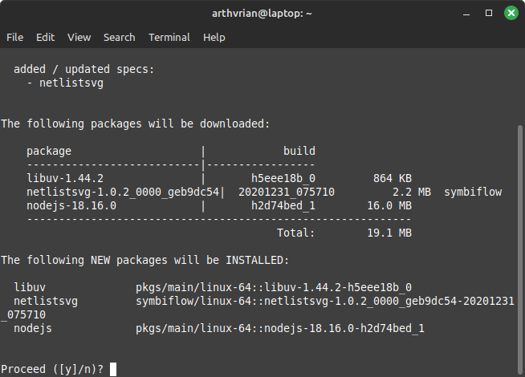


### Instalación de Yosys en el entorno virtual de MiniConda

Para instalar Yosys en el entorno virtual de MiniConda en Linux, se debe ejecutar el siguiente comando:

```conda install -c "litex-hub" yosys```

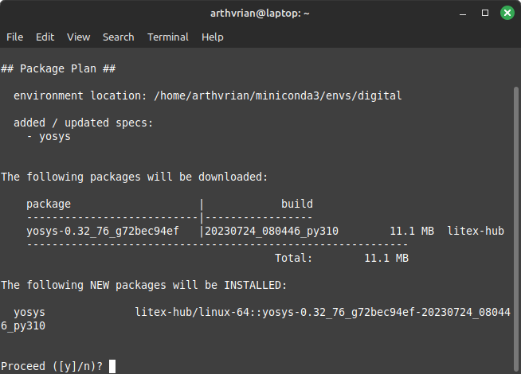


### Instalación de Icarus Verilog en el entorno virtual de MiniConda

Para instalar Icarus Verilog en el entorno virtual de MiniConda en Linux, se debe ejecutar el siguiente comando:

```conda install -c "litex-hub" iverilog```


## Instalación de Digital

Para correr Digital en Linux, se debe instalar primero el JDK, con el siguiente comando:

```sudo apt install openjdk-19-jdk```

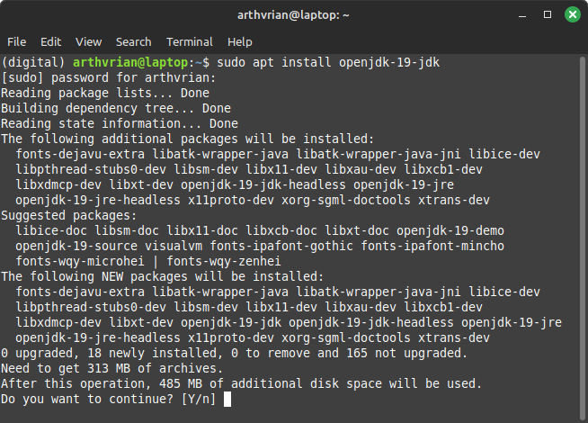

Y descargarlo desde su página oficial: [Digital](https://github.com/hneemann/Digital/releases/latest/download/Digital.zip)

## Instalación de Geany

Para instalar Geany en Linux, se debe ejecutar el siguiente comando:

```sudo apt install geany```

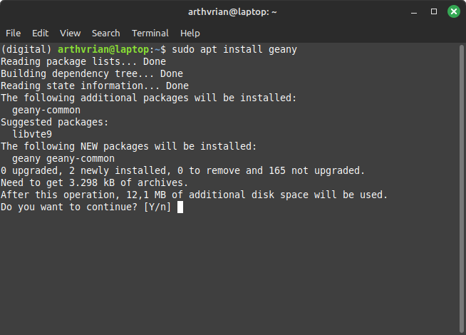

### Instalar plugins de Geany

Para instalar los plugins de Geany en Linux, se debe ejecutar el siguiente comando:

- Commander

```sudo apt install geany-plugin-commander```

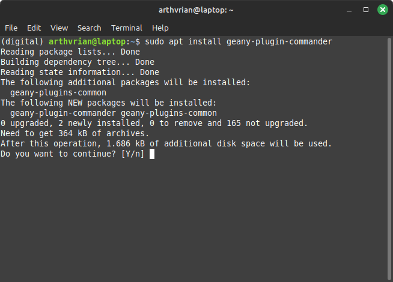

- Git Change Bar

```sudo apt install geany-plugin-git-changebar```

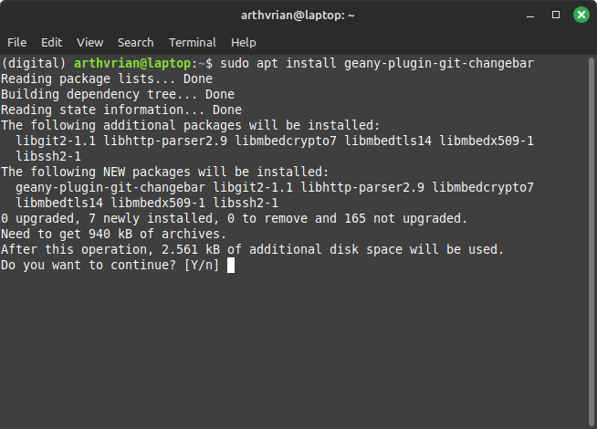

- Markdown

```sudo apt install geany-plugin-markdown```

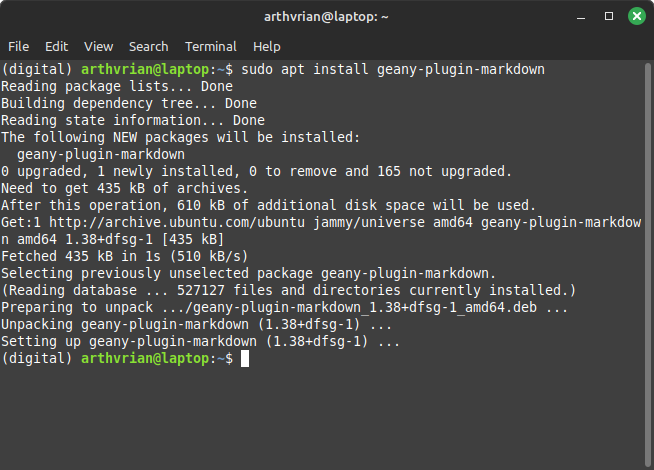

# Problemas y soluciones

A continuación se muestran los problemas que se presentaron durante la instalación de las herramientas y sus respectivas 
soluciones.

## Problema con la instalación de Linux Mint

En la sección de instalación de linux en "tipos de instalación" al momento de generar las 3 particiones que fueron la 
del área de intercambio, la partición raíz, la partición Home, y continuar xon la instalación se generaba un error, ya 
que solicitaba una partición para la EFI, por lo que se generó una partición adicional de 512 MB que se recomendaba para 
la EFI.

Luego de generar la cuarta participación de la EFI, se dio inicio al proceso de instalación, pero en el transcurso de 
instalación se genera el error "grub-install/dev/sda fail". 

.

Para solucionar esta falla se reinicia el sistema y luego se vuelve a iniciar el proceso de instalación, donde, en vez 
de seleccionar "Más opciones" se selecciona en reinstalar, permitiendo finalizar con la instalación sin errores.

## Problema con la instalación de Digital

En un principio se pensó en usar Ubuntu para Windows (WSL2) (https://ubuntu.com/tutorials/install-ubuntu-on-wsl2-on-windows-11-with-gui-support#1-overview), 
pero al intentar correr Digital, se presentó el siguiente error:


El problema se presentó porque Digital es de entorno gráfico y Ubuntu para Windows no tiene soporte para entornos 
gráficos por defecto, era necesario instalar un servidor de ventanas y configurar Ubuntu para Windows para que use ese 
servidor de ventanas, sin ser posible asegurar que este ajuste funcionase correctamente.

La solución a este problema fue instalar Linux Mint en un laptop viejo que tenía disponible y alli instalar todas las 
herramientas necesarias para el curso.

# Documentación

- [Documentación de Linux Mint](https://linuxmint.com/documentation.php)
- [Documentación de Git](https://git-scm.com/doc)
- [Documentación de MiniConda](https://docs.conda.io/en/latest/)
- [Documentación de GTKWave](http://gtkwave.sourceforge.net/)
- [Documentación de Graphviz](https://graphviz.org/documentation/)
- [Documentación de NetListSVG](https://github.com/nturley/netlistsvg)
- [Documentación de Yosys](https://yosyshq.net/yosys/documentation.html)
- [Documentación de Icarus Verilog](http://iverilog.icarus.com/)
- [Documentación de Digital](https://github.com/hneemann/Digital/releases/tag/v0.30)
- [Documentación de Geany](https://www.geany.org/manual/current/index.html)