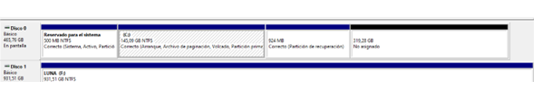
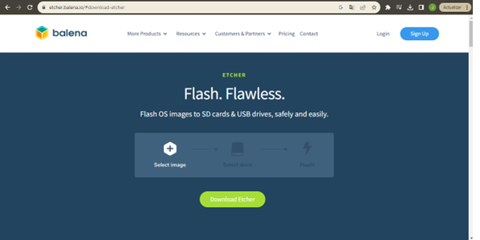
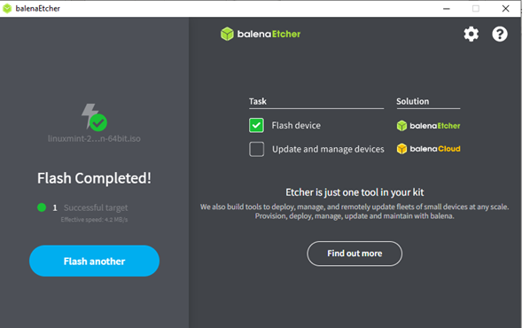

## Laboratorio I

Instalación del entorno de desarrollo que se usará en clase

# Instalación de Linux

Por sugerencia del profesor Johnny Cubides, se instalará la distribución de Linux [Mint](https://www.linuxmint.com/) en su versión Cinnamon.


Para proceder con la instalación de Linux Mint, se implemento el proceso a partir de Dual Boot, de esta marena podemos mantener el sistema operativo de Windows e instalar Linux en el mismo ordenador. La Bios en este caso se encargara de de cargar el gestor de arranque y desde el disco duro se llamará al sistema operativo que se desee iniciar. 

Los primero que se debe realizar es la partición del disco duro; la recomendación para instalar Linux es destinar una espacio en memoria de 30 a 100 GB. 



Debemos descargar el ISO de Linux Mint Cinnamon desde [Mint](https://www.linuxmint.com/) y desde [Balena](https://www.balena.io/) descargamos e instalamos BalenaEtcher.



Luego de que finalice la instalación de BalenaEtcher, debemos insertar en el ordenador un pendrive de almenos 8GB. Iniciamos BalenaEtcher para almacenar el instalador de Linux al pendrive.



Al finalizar el almacenamiento del instalador de Linux, debemos reiniciar el ordenador con el pendrive conectado; antes de que inicie el ordenador se debe oprimir "F1" para ingresar a la BIOS del sistema y poder seleccionar el medio de inicio del ordenador, en este caso, se seleccionará el pendrive y luego se dará Enter en Star Lunix Mint, para iniciar Linux de prueba.

Cuando inicie el sistema operativo, se procederá con la instalación, se debe seleccionar el idioma, luego el tipo de teclado, y en Tipo de Instalación de sebe seleccionar "Más opciones" y continuar. En la nueva ventana, se deben administrar el espacio libre que se destinó en memoria cuando se realizó la partición del disco. 

Con el espacio libre, se deben realizar 4 particiones, la primera es el área de intercambio, que servirá como complemento de la memoria RAM, la segunda es la partición raíz, donde se instalará el sistema operativo y los programas que se necesiten, la tercera partición es la EFI, que actúa como el lugar de almacenamiento para los cargadores de arranque y por último, la partición Home, donde se guardarán los archivos.

Luego de generar las particiones se continua con la instalación. Por último se reinicia el ordenador y se desconecta el pendrive, y listo ya queda instalado Linux Mint en el ordenador, conservando el sistema operativo Windows.


# Instalación de herramientas

## Instalación de Git

Para instalar Git en Linux, se debe ejecutar el siguiente comando:

```sudo apt install git-all```

## Instalación de MiniConda

Para instalar MiniConda en Linux, se debe ejecutar el siguiente comando:

```wget https://repo.anaconda.com/miniconda/Miniconda3-latest-Linux-x86_64.sh```

y luego

```bash Miniconda3-latest-Linux-x86_64.sh```


Luego seguir las instrucciones que se muestran en la terminal.

### Creación del entorno virtual

Seguir las instrucciones de la siguiente página: [Instalación de miniconda](https://github.com/johnnycubides/digital-electronic-1-101/tree/main/installTools) del profesor Johnny Cubides

### Instalación de GTKWave en el entorno virtual de MiniConda

Para instalar GTKWave en el entorno virtual de MiniConda en Linux, se debe ejecutar el siguiente comando:

```conda install -c conda-forge gtkwave```


### Instalación de Graphviz en el entorno virtual de MiniConda

Para instalar Graphviz en el entorno virtual de MiniConda en Linux, se debe ejecutar el siguiente comando:

```conda install -c conda-forge graphviz```

### Instalación de NetListSVG en el entorno virtual de MiniConda

Para instalar NetListSVG en el entorno virtual de MiniConda en Linux, se debe ejecutar el siguiente comando:

```conda install -c symbiflow netlistsvg```


### Instalación de Yosys en el entorno virtual de MiniConda

Para instalar Yosys en el entorno virtual de MiniConda en Linux, se debe ejecutar el siguiente comando:

```conda install -c "litex-hub" yosys```


### Instalación de Icarus Verilog en el entorno virtual de MiniConda

Para instalar Icarus Verilog en el entorno virtual de MiniConda en Linux, se debe ejecutar el siguiente comando:

```conda install -c "litex-hub" iverilog```


## Instalación de Digital

Para correr Digital en Linux, se debe instalr primero el JDK, con el siguiente comando:

```sudo apt install openjdk-11-jdk```

Y descargarlo desde su página oficial: [Digital](https://github.com/hneemann/Digital/releases/latest/download/Digital.zip)

# Problemas y soluciones

A continuación se muestran los problemas que se presentaron durante la instalación de las herramientas y sus respectivas 
soluciones.

## Problema con la instalacion de Linux Mint

En la seccion de instalacion de linux en "tipos de instalación" al momento de generar las 3 particiones que fueron la del área de intercambio, la partición raíz, la partición Home, y continuar xon la instalación se generaba un error ya que solicitaba una particion para la EFI, por lo que se genero una particion adicional de 512 MB que se recomendaba para la EFI.

Luego de generar la cuarta participación de la EFI, se dio inicio al proceso de instalación, pero en el transcurso de instalación se genera el error "grub-install/dev/sda fail". 

.

Para solucionar esta falla se reinicio el sistema y luego se volvio a iniciar el proceso de instalación, donde en vez de seleccionar "Más opciones" se seleccionó en reinstalar, permitiendo finalizar xon la instalación.

## Problema con la instalación de Digital

En un principio se pensó en usar Ubuntu para Windows (WSL2) (https://ubuntu.com/tutorials/install-ubuntu-on-wsl2-on-windows-11-with-gui-support#1-overview), 
pero al intentar correr Digital, se presentó el siguiente error:


El problema se presentó porque Digital es de entorno gráfico y Ubuntu para Windows no tiene soporte para entornos 
gráficos por defecto, era necesario instalar un servidor de ventanas y configurar Ubuntu para Windows para que use ese 
servidor de ventanas, sin ser posible asegurar que este ajuste funcionase correctamente.

La solución a este problema fue instalar Linux Mint en un laptop viejo que tenía disponible y alli instalar todas las 
herramientas necesarias para el curso.
