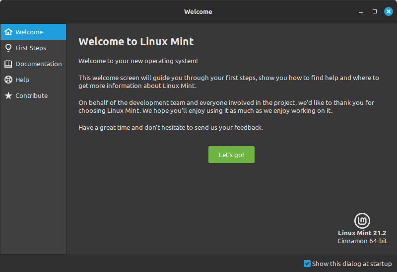
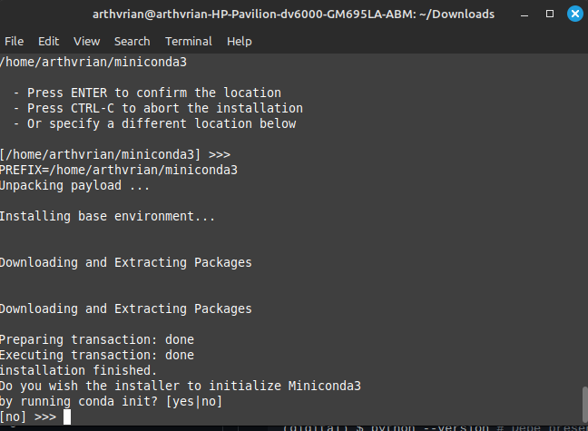
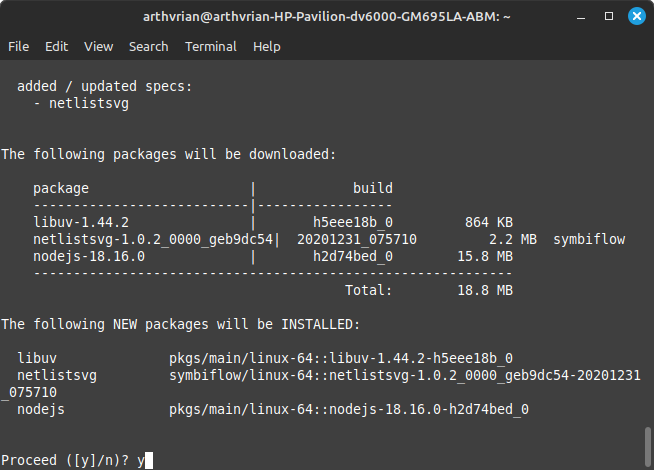
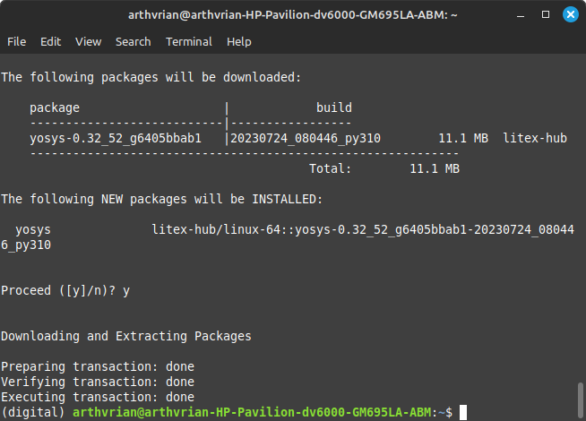
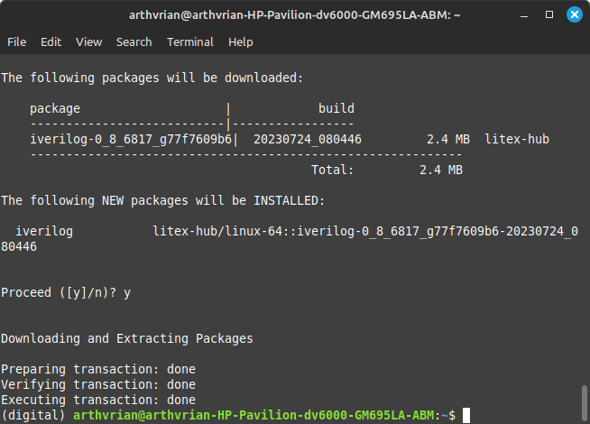
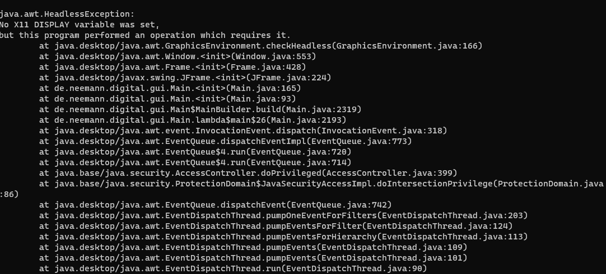

## Laboratorio I

Instalación del entorno de desarrollo que se usará en clase

# Instalación de Linux

Por sugerencia del profesor Johnny Cubides, se instalará la distribución de Linux [Mint](https://www.linuxmint.com/) en su versión Cinnamon.



# Instalación de herramientas

## Instalación de Git

Para instalar Git en Linux, se debe ejecutar el siguiente comando:

```sudo apt install git-all```

## Instalación de MiniConda

Para instalar MiniConda en Linux, se debe ejecutar el siguiente comando:

```wget https://repo.anaconda.com/miniconda/Miniconda3-latest-Linux-x86_64.sh```

y luego

```bash Miniconda3-latest-Linux-x86_64.sh```




Luego seguir las instrucciones que se muestran en la terminal.

### Creación del entorno virtual

Seguir las instrucciones de la siguiente página: [Instalación de miniconda](https://github.com/johnnycubides/digital-electronic-1-101/tree/main/installTools) del profesor Johnny Cubides

### Instalación de GTKWave en el entorno virtual de MiniConda

Para instalar GTKWave en el entorno virtual de MiniConda en Linux, se debe ejecutar el siguiente comando:

```conda install -c conda-forge gtkwave```


### Instalación de Graphviz en el entorno virtual de MiniConda

Para instalar Graphviz en el entorno virtual de MiniConda en Linux, se debe ejecutar el siguiente comando:

```conda install -c conda-forge graphviz```

### Instalación de NetListSVG en el entorno virtual de MiniConda

Para instalar NetListSVG en el entorno virtual de MiniConda en Linux, se debe ejecutar el siguiente comando:

```conda install -c symbiflow netlistsvg```




### Instalación de Yosys en el entorno virtual de MiniConda

Para instalar Yosys en el entorno virtual de MiniConda en Linux, se debe ejecutar el siguiente comando:

```conda install -c "litex-hub" yosys```




### Instalación de Icarus Verilog en el entorno virtual de MiniConda

Para instalar Icarus Verilog en el entorno virtual de MiniConda en Linux, se debe ejecutar el siguiente comando:

```conda install -c "litex-hub" icarus-verilog```




## Instalación de Digital

Para correr Digital en Linux, se debe instalr primero el JDK, con el siguiente comando:

```sudo apt install openjdk-11-jdk```

Y descargarlo desde su página oficial: [Digital](https://github.com/hneemann/Digital/releases/latest/download/Digital.zip)

# Problemas y soluciones

A continuación se muestran los problemas que se presentaron durante la instalación de las herramientas y sus respectivas 
soluciones.

## Problema con la instalación de Digital

En un principio se pensó en usar Ubuntu para Windows (WSL2) (https://ubuntu.com/tutorials/install-ubuntu-on-wsl2-on-windows-11-with-gui-support#1-overview), 
pero al intentar correr Digital, se presentó el siguiente error:



El problema se presentó porque Digital es de entorno gráfico y Ubuntu para Windows no tiene soporte para entornos 
gráficos por defecto, era necesario instalar un servidor de ventanas y configurar Ubuntu para Windows para que use ese 
servidor de ventanas, sin ser posible asegurar que este ajuste funcionase correctamente.

La solución a este problema fue instalar Linux Mint en un laptop viejo que tenía disponible y alli instalar todas las 
herramientas necesarias para el curso.